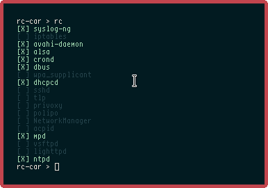

#  rc-car (fork of minirc)

The script "rc" is a minimalistic init script made for use with busybox init.



## Installing

Dependencies:

```sh
busybox
eudev or systemd (for udev)
```

1. When you are confident, run "./setup.sh --force"
2. Remove "init=..." from your kernel parameters (if it is there) so that the default value "init=/sbin/init" is used.
3. Configure /etc/rccar.conf to your needs.
4. Reboot.

## Dealing with services

The variable DAEMONS is used for listing the runnable services.

The variable ENABLED is used to define services that are started on boot.

+ First, write a .tire file for your service that you want to enable in `/etc/rc-car/service/<daemon name>.tire` files.
+ Then, write its name in the ENABLED variable in `/etc/rccar.conf` which is sourced by rc-car on boot and while running.
+ Now you can start/stop/restart/poll the service.

## Shutdown & Reboot

You can run `rc shutdown` or `rc reboot` to accomplish this.

## Further Help

Run "rc --help" for information.

**Never run "rc init" except during the boot process, when called by the init.**

## About

* Authors: Roman Zimbelmann, Sam Stuewe
* Forked by: Lains, Reed
* License: GPL2
